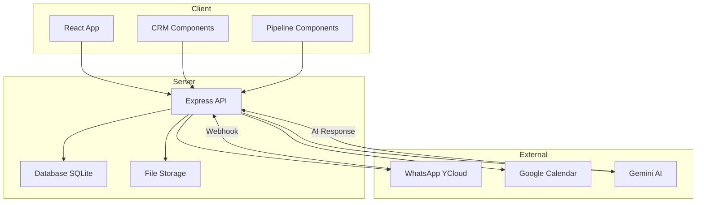
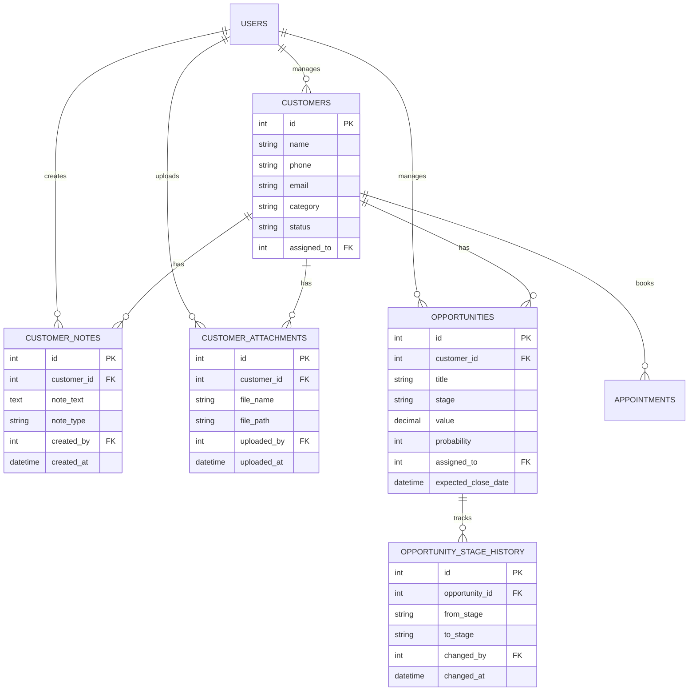
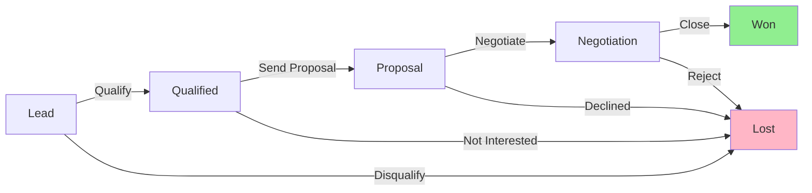
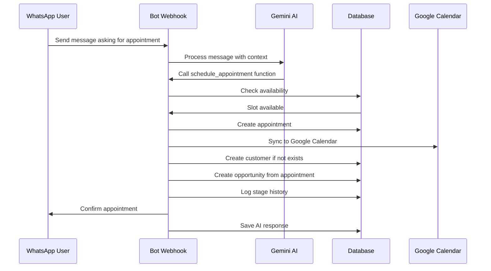
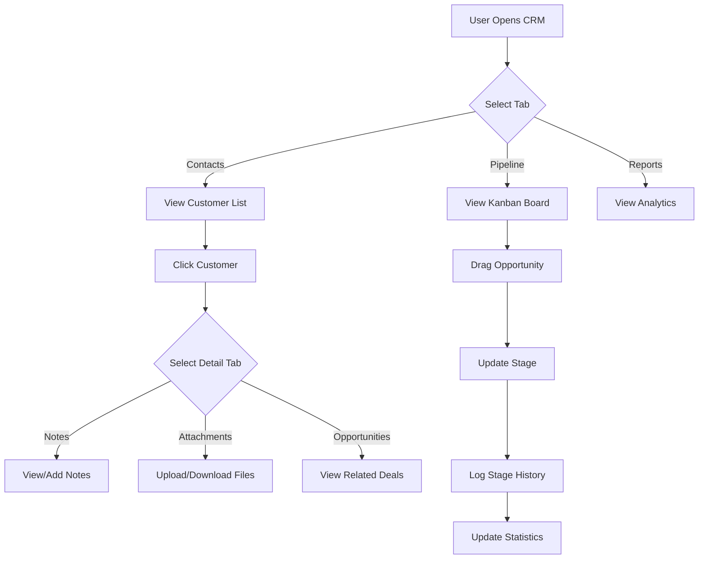

# Enhanced CRM System - Technical Specification

## Project Overview
This document provides a comprehensive technical specification for enhancing the existing WhatsApp chatbot CRM system with advanced contact management, notes, file attachments, and a sales pipeline (embudo de ventas).

## Current System Analysis

### Existing Database Schema
- **customers**: Basic contact information (id, name, phone, email, notes, last_interaction, created_at)
- **appointments**: Appointment tracking with Google Calendar integration
- **messages**: WhatsApp message history
- **users**: Staff authentication and roles
- **patients**: Basic patient registration

### Existing Features
- Basic contact management (CRUD operations)
- WhatsApp bot integration with Gemini AI
- Appointment scheduling with Google Calendar sync
- Real-time message tracking
- Dashboard with analytics

---

## Enhanced CRM Requirements

### 1. Contact Management with Categories

#### Database Schema Changes

**Update `customers` table:**
```sql
-- Migration: Add category field to customers table
ALTER TABLE customers ADD COLUMN category TEXT DEFAULT 'contact' 
  CHECK(category IN ('prospect', 'client', 'contact'));
ALTER TABLE customers ADD COLUMN status TEXT DEFAULT 'active' 
  CHECK(status IN ('active', 'inactive', 'archived'));
ALTER TABLE customers ADD COLUMN company TEXT;
ALTER TABLE customers ADD COLUMN position TEXT;
ALTER TABLE customers ADD COLUMN tags TEXT; -- JSON array of tags
ALTER TABLE customers ADD COLUMN source TEXT; -- How they found us: WhatsApp, referral, etc.
ALTER TABLE customers ADD COLUMN assigned_to INTEGER; -- Foreign key to users table
ALTER TABLE customers ADD COLUMN updated_at DATETIME DEFAULT CURRENT_TIMESTAMP;
```

#### Category Definitions
- **Prospects**: Potential customers showing interest but not yet converted
- **Clients**: Active paying customers with confirmed purchases/services
- **Contacts**: General contacts, partners, or other relationships

---

### 2. Notes System

#### Database Schema

**Create `customer_notes` table:**
```sql
CREATE TABLE IF NOT EXISTS customer_notes (
  id INTEGER PRIMARY KEY AUTOINCREMENT,
  customer_id INTEGER NOT NULL,
  note_text TEXT NOT NULL,
  note_type TEXT DEFAULT 'general' CHECK(note_type IN ('general', 'call', 'meeting', 'email', 'other')),
  is_pinned INTEGER DEFAULT 0,
  created_at DATETIME DEFAULT CURRENT_TIMESTAMP,
  created_by INTEGER NOT NULL, -- Foreign key to users table
  updated_at DATETIME DEFAULT CURRENT_TIMESTAMP,
  FOREIGN KEY (customer_id) REFERENCES customers(id) ON DELETE CASCADE,
  FOREIGN KEY (created_by) REFERENCES users(id)
);

-- Index for performance
CREATE INDEX idx_customer_notes_customer_id ON customer_notes(customer_id);
CREATE INDEX idx_customer_notes_created_at ON customer_notes(created_at DESC);
```

#### Features
- Multiple notes per contact
- Author tracking (which user created the note)
- Timestamp for each note
- Note types for categorization
- Pin important notes to top
- Markdown support for rich text formatting
- Edit and delete capabilities
- Search within notes

---

### 3. File Attachments

#### Database Schema

**Create `customer_attachments` table:**
```sql
CREATE TABLE IF NOT EXISTS customer_attachments (
  id INTEGER PRIMARY KEY AUTOINCREMENT,
  customer_id INTEGER NOT NULL,
  file_name TEXT NOT NULL,
  file_original_name TEXT NOT NULL,
  file_path TEXT NOT NULL,
  file_type TEXT NOT NULL, -- image, document, pdf, etc.
  file_size INTEGER NOT NULL, -- in bytes
  mime_type TEXT,
  description TEXT,
  uploaded_at DATETIME DEFAULT CURRENT_TIMESTAMP,
  uploaded_by INTEGER NOT NULL, -- Foreign key to users table
  FOREIGN KEY (customer_id) REFERENCES customers(id) ON DELETE CASCADE,
  FOREIGN KEY (uploaded_by) REFERENCES users(id)
);

-- Index for performance
CREATE INDEX idx_customer_attachments_customer_id ON customer_attachments(customer_id);
CREATE INDEX idx_customer_attachments_uploaded_at ON customer_attachments(uploaded_at DESC);
```

#### Storage Implementation
- Files stored in `uploads/customers/{customer_id}/` directory structure
- Unique filename generation to prevent conflicts
- File size limit: 10MB per file
- Allowed types: PDF, DOC, DOCX, XLS, XLSX, JPG, JPEG, PNG, GIF
- Security: Authentication required for downloads
- Virus scanning consideration (optional enhancement)

---

### 4. Sales Pipeline (Embudo de Ventas)

#### Database Schema

**Create `opportunities` table:**
```sql
CREATE TABLE IF NOT EXISTS opportunities (
  id INTEGER PRIMARY KEY AUTOINCREMENT,
  customer_id INTEGER NOT NULL,
  title TEXT NOT NULL,
  description TEXT,
  stage TEXT NOT NULL DEFAULT 'lead' 
    CHECK(stage IN ('lead', 'qualified', 'proposal', 'negotiation', 'won', 'lost')),
  value DECIMAL(10,2) DEFAULT 0, -- Deal value in currency
  currency TEXT DEFAULT 'MXN',
  probability INTEGER DEFAULT 50, -- 0-100 percentage
  expected_close_date DATE,
  actual_close_date DATE,
  lost_reason TEXT, -- Reason if stage = lost
  source TEXT, -- Where the opportunity came from
  assigned_to INTEGER, -- Foreign key to users table
  priority TEXT DEFAULT 'medium' CHECK(priority IN ('low', 'medium', 'high', 'urgent')),
  created_at DATETIME DEFAULT CURRENT_TIMESTAMP,
  updated_at DATETIME DEFAULT CURRENT_TIMESTAMP,
  created_by INTEGER NOT NULL,
  FOREIGN KEY (customer_id) REFERENCES customers(id) ON DELETE CASCADE,
  FOREIGN KEY (assigned_to) REFERENCES users(id),
  FOREIGN KEY (created_by) REFERENCES users(id)
);

-- Track stage history for analytics
CREATE TABLE IF NOT EXISTS opportunity_stage_history (
  id INTEGER PRIMARY KEY AUTOINCREMENT,
  opportunity_id INTEGER NOT NULL,
  from_stage TEXT,
  to_stage TEXT NOT NULL,
  changed_at DATETIME DEFAULT CURRENT_TIMESTAMP,
  changed_by INTEGER NOT NULL,
  notes TEXT,
  FOREIGN KEY (opportunity_id) REFERENCES opportunities(id) ON DELETE CASCADE,
  FOREIGN KEY (changed_by) REFERENCES users(id)
);

-- Index for performance
CREATE INDEX idx_opportunities_customer_id ON opportunities(customer_id);
CREATE INDEX idx_opportunities_stage ON opportunities(stage);
CREATE INDEX idx_opportunities_expected_close_date ON opportunities(expected_close_date);
```

#### Pipeline Stages
1. **Lead**: Initial contact, minimal qualification
   - Default probability: 10%
2. **Qualified**: Verified need, budget, and authority
   - Default probability: 30%
3. **Proposal**: Formal proposal or quote sent
   - Default probability: 50%
4. **Negotiation**: Terms, pricing, timeline discussion
   - Default probability: 70%
5. **Won**: Deal closed successfully
   - Probability: 100%
6. **Lost**: Opportunity lost to competitor or no decision
   - Probability: 0%

---

### 5. Bot Integration with Sales Pipeline

#### Automatic Opportunity Creation

**Trigger Points:**
1. When bot successfully schedules an appointment → Create opportunity
2. When customer asks about specific services → Create lead opportunity
3. When customer shows high interest (multiple interactions) → Create qualified lead

**Implementation Logic:**
```javascript
// In server/index.js webhook handler
async function createOpportunityFromAppointment(appointmentId, phoneNumber, appointmentType) {
  const appointment = db.prepare('SELECT * FROM appointments WHERE id = ?').get(appointmentId);
  
  // Find or create customer
  let customer = db.prepare('SELECT * FROM customers WHERE phone = ?').get(phoneNumber);
  if (!customer) {
    const result = db.prepare(
      'INSERT INTO customers (phone, name, category, source, last_interaction) VALUES (?, ?, ?, ?, ?)'
    ).run(phoneNumber, appointment.patient_name, 'prospect', 'whatsapp_bot', new Date().toISOString());
    customer = { id: result.lastInsertRowid };
  } else {
    // Update category to prospect if just contact
    db.prepare(
      'UPDATE customers SET category = ?, last_interaction = ? WHERE id = ?'
    ).run('prospect', new Date().toISOString(), customer.id);
  }
  
  // Create opportunity
  const opportunityTitle = `${appointmentType} - ${appointment.patient_name}`;
  const stage = determineStageFromAppointmentType(appointmentType);
  const value = estimateValueFromService(appointmentType);
  
  const oppResult = db.prepare(`
    INSERT INTO opportunities 
    (customer_id, title, stage, value, probability, source, created_by)
    VALUES (?, ?, ?, ?, ?, ?, ?)
  `).run(
    customer.id,
    opportunityTitle,
    stage,
    value,
    stage === 'qualified' ? 30 : 10,
    'whatsapp_bot',
    1 // System user
  );
  
  // Log stage history
  db.prepare(`
    INSERT INTO opportunity_stage_history 
    (opportunity_id, to_stage, changed_by, notes)
    VALUES (?, ?, ?, ?)
  `).run(oppResult.lastInsertRowid, stage, 1, 'Auto-created from appointment booking');
  
  return oppResult.lastInsertRowid;
}

function determineStageFromAppointmentType(type) {
  const consultationTypes = ['consulta', 'evaluacion', 'valoracion'];
  const isConsultation = consultationTypes.some(t => 
    type.toLowerCase().includes(t)
  );
  return isConsultation ? 'lead' : 'qualified';
}

function estimateValueFromService(serviceType) {
  const serviceValues = {
    'botox': 3000,
    'rellenos': 4000,
    'limpieza': 800,
    'peeling': 1500,
    'consulta': 500
  };
  
  for (const [key, value] of Object.entries(serviceValues)) {
    if (serviceType.toLowerCase().includes(key)) {
      return value;
    }
  }
  return 1000; // Default value
}
```

#### Integration Points in Bot Webhook
```javascript
// After successful appointment creation (line ~759 in server/index.js)
if (name === 'schedule_appointment') {
  // ... existing code ...
  if (!available && !alreadyBooked && !isBusy) {
    const result = db.prepare('INSERT INTO appointments...').run(...);
    
    // NEW: Create opportunity from appointment
    try {
      const opportunityId = await createOpportunityFromAppointment(
        result.lastInsertRowid,
        phoneNumber,
        appointment_type
      );
      console.log(`Created opportunity ${opportunityId} from appointment ${result.lastInsertRowid}`);
    } catch (error) {
      console.error('Error creating opportunity:', error);
      // Don't fail the appointment if opportunity creation fails
    }
    
    // ... rest of existing code ...
  }
}
```

---

## API Endpoints Specification

### Customer Endpoints (Enhanced)

#### GET /api/customers
```javascript
// Query parameters: category, status, search, assigned_to, sort, limit, offset
// Response: Array of customers with aggregated data
{
  customers: [
    {
      id, name, phone, email, category, status, company, position,
      tags, source, assigned_to, assigned_user_name,
      last_interaction, created_at, updated_at,
      notes_count, attachments_count, opportunities_count,
      total_opportunity_value
    }
  ],
  total: 150,
  page: 1,
  pageSize: 50
}
```

#### PUT /api/customers/:id/category
```javascript
// Body: { category: 'prospect' | 'client' | 'contact' }
// Response: { success: true, customer: {...} }
```

---

### Notes Endpoints

#### GET /api/customers/:customerId/notes
```javascript
// Response: Array of notes sorted by created_at DESC (pinned first)
[
  {
    id, customer_id, note_text, note_type, is_pinned,
    created_at, updated_at,
    author: { id, email, name }
  }
]
```

#### POST /api/customers/:customerId/notes
```javascript
// Body: { note_text, note_type?, is_pinned? }
// Response: { success: true, note: {...} }
```

#### PUT /api/customers/:customerId/notes/:noteId
```javascript
// Body: { note_text?, note_type?, is_pinned? }
// Response: { success: true, note: {...} }
```

#### DELETE /api/customers/:customerId/notes/:noteId
```javascript
// Response: { success: true }
```

---

### Attachments Endpoints

#### GET /api/customers/:customerId/attachments
```javascript
// Response: Array of attachments
[
  {
    id, customer_id, file_name, file_original_name, file_type,
    file_size, mime_type, description,
    download_url: '/api/customers/:id/attachments/:attachmentId/download',
    uploaded_at,
    uploader: { id, email, name }
  }
]
```

#### POST /api/customers/:customerId/attachments
```javascript
// Content-Type: multipart/form-data
// Body: FormData with 'file' and optional 'description'
// Response: { success: true, attachment: {...} }
```

#### GET /api/customers/:customerId/attachments/:attachmentId/download
```javascript
// Response: File stream with appropriate headers
// Security: Verify user has access to customer record
```

#### DELETE /api/customers/:customerId/attachments/:attachmentId
```javascript
// Response: { success: true }
// Also removes file from filesystem
```

---

### Opportunities Endpoints

#### GET /api/opportunities
```javascript
// Query parameters: stage, customer_id, assigned_to, priority, sort
// Response: Array of opportunities with customer info
[
  {
    id, customer_id, title, description, stage, value, currency,
    probability, expected_close_date, actual_close_date,
    priority, source, assigned_to,
    created_at, updated_at,
    customer: { id, name, phone, email, category },
    assigned_user: { id, email, name },
    stage_duration_days: 5
  }
]
```

#### GET /api/opportunities/:id
```javascript
// Response: Detailed opportunity with history
{
  opportunity: {...},
  stage_history: [
    {
      id, from_stage, to_stage, changed_at,
      changed_by_user: { id, email, name },
      notes
    }
  ],
  customer: {...},
  notes: [...],
  attachments: [...]
}
```

#### POST /api/opportunities
```javascript
// Body: 
{
  customer_id, title, description?, stage?, value?, currency?,
  probability?, expected_close_date?, priority?, source?
}
// Response: { success: true, opportunity: {...} }
```

#### PUT /api/opportunities/:id
```javascript
// Body: Any opportunity fields
// If stage changed, automatically creates stage_history entry
// Response: { success: true, opportunity: {...} }
```

#### PUT /api/opportunities/:id/stage
```javascript
// Body: { stage, notes? }
// Creates stage_history entry
// Response: { success: true, opportunity: {...} }
```

#### DELETE /api/opportunities/:id
```javascript
// Response: { success: true }
```

#### GET /api/opportunities/pipeline-stats
```javascript
// Response: Pipeline analytics
{
  by_stage: {
    lead: { count: 10, total_value: 50000 },
    qualified: { count: 5, total_value: 75000 },
    // ... other stages
  },
  conversion_rates: {
    lead_to_qualified: 40,
    qualified_to_proposal: 60,
    // ... other conversions
  },
  avg_stage_duration: {
    lead: 3.5, // days
    qualified: 7.2,
    // ... other stages
  },
  total_pipeline_value: 250000,
  weighted_pipeline_value: 125000 // sum of (value * probability)
}
```

---

## UI/UX Design Specification

### 1. Enhanced CRM Page Structure

```
┌─────────────────────────────────────────────────────────────┐
│  CRM Header                                                  │
│  ┌──────────┬──────────┬──────────┬──────────┐             │
│  │ Contacts │  Pipeline │ Reports  │ Settings │             │
│  └──────────┴──────────┴──────────┴──────────┘             │
└─────────────────────────────────────────────────────────────┘
```

#### Tab Navigation
- **Contacts Tab**: Enhanced customer list with filtering
- **Pipeline Tab**: Kanban board with drag-and-drop
- **Reports Tab**: Analytics and dashboards
- **Settings Tab**: CRM configuration

---

### 2. Contacts Tab (Enhanced)

#### Layout
```
┌─────────────────────────────────────────────────────────────┐
│  🔍 Search...    [All Categories ▼]  [+ New Contact]        │
├─────────────────────────────────────────────────────────────┤
│  📊 Stats Cards:                                            │
│  ┌────────────┬────────────┬────────────┬────────────┐     │
│  │ 50 Total   │ 15 Prosp   │ 30 Clients │ 5 Contacts │     │
│  └────────────┴────────────┴────────────┴────────────┘     │
├─────────────────────────────────────────────────────────────┤
│  Customer Table with:                                       │
│  - Avatar/Initial                                           │
│  - Name + Category Badge                                    │
│  - Contact Info (phone, email)                              │
│  - Last Interaction                                         │
│  - Assigned To                                              │
│  - Quick Actions (View, Edit, Delete)                       │
│  - Notes/Attachments/Opportunities count badges             │
└─────────────────────────────────────────────────────────────┘
```

#### Features
- **Filtering**: By category, status, assigned user, tags
- **Sorting**: By name, date, last interaction, value
- **Bulk Actions**: Mass category change, bulk delete, export
- **Quick View**: Hover preview of contact details
- **Category Badges**: Color-coded (Prospect=yellow, Client=green, Contact=blue)

---

### 3. Customer Detail View (Modal or Side Panel)

#### Layout
```
┌─────────────────────────────────────────────────────────────┐
│  [<] Customer: Juan Pérez                    [Edit] [Delete]│
├─────────────────────────────────────────────────────────────┤
│  Profile Section:                                           │
│  ┌─────────────────────────────────────────────────────┐   │
│  │ 👤 Juan Pérez                                        │   │
│  │ 📱 +52 1234567890    📧 juan@example.com            │   │
│  │ 🏢 Company: Tech Corp    💼 Position: Manager       │   │
│  │ 🏷️  Tags: VIP, High-Value                           │   │
│  │ 📊 Category: [Client ▼]   Status: [Active ▼]        │   │
│  │ 👤 Assigned: Maria Lopez                            │   │
│  └─────────────────────────────────────────────────────┘   │
├─────────────────────────────────────────────────────────────┤
│  Tab Navigation:                                            │
│  ┌─────┬─────────┬──────────────┬──────────────┬──────┐   │
│  │Notes│Attachmts│Opportunities │ Appointments │ Msgs │   │
│  └─────┴─────────┴──────────────┴──────────────┴──────┘   │
├─────────────────────────────────────────────────────────────┤
│  [Active Tab Content Here]                                  │
└─────────────────────────────────────────────────────────────┘
```

#### Notes Tab
```
┌─────────────────────────────────────────────────────────────┐
│  [+ Add Note]                                               │
├─────────────────────────────────────────────────────────────┤
│  📌 Pinned Notes:                                           │
│  ┌─────────────────────────────────────────────────────┐   │
│  │ 📌 Important: Follow up next week                    │   │
│  │    By: Maria L. • 2 days ago • [Call]                │   │
│  │    [📝 Edit] [📌 Unpin] [🗑️ Delete]                   │   │
│  └─────────────────────────────────────────────────────┘   │
│                                                             │
│  Recent Notes:                                              │
│  ┌─────────────────────────────────────────────────────┐   │
│  │ Discussed pricing options...                         │   │
│  │ By: John D. • 5 days ago • [Meeting]                 │   │
│  │ [📝 Edit] [📌 Pin] [🗑️ Delete]                        │   │
│  └─────────────────────────────────────────────────────┘   │
│  [Load More...]                                             │
└─────────────────────────────────────────────────────────────┘
```

**Note Editor:**
- Markdown support with preview
- Note type selector (Call, Meeting, Email, General)
- Pin toggle
- Auto-save draft
- @mention support for team members (future)

#### Attachments Tab
```
┌─────────────────────────────────────────────────────────────┐
│  [📎 Upload File]                                           │
├─────────────────────────────────────────────────────────────┤
│  Files (5):                                                 │
│  ┌─────────────────────────────────────────────────────┐   │
│  │ 📄 Contrato_signed.pdf • 245 KB                      │   │
│  │    Uploaded by: Maria L. • Jan 5, 2026               │   │
│  │    [⬇️ Download] [👁️ Preview] [🗑️ Delete]            │   │
│  └─────────────────────────────────────────────────────┘   │
│  ┌─────────────────────────────────────────────────────┐   │
│  │ 🖼️  Before_photo.jpg • 1.2 MB                        │   │
│  │    With inline image preview                         │   │
│  │    [⬇️ Download] [👁️ Preview] [🗑️ Delete]            │   │
│  └─────────────────────────────────────────────────────┘   │
└─────────────────────────────────────────────────────────────┘
```

**Features:**
- Drag-and-drop upload
- File preview (images, PDFs)
- Download with authentication
- File size and type validation
- Progress indicator during upload

#### Opportunities Tab
```
┌─────────────────────────────────────────────────────────────┐
│  [+ New Opportunity]                                        │
├─────────────────────────────────────────────────────────────┤
│  Active Opportunities (2):                                  │
│  ┌─────────────────────────────────────────────────────┐   │
│  │ 💼 Botox Treatment Package                           │   │
│  │    Stage: Proposal • $3,000 MXN • 50% probability    │   │
│  │    Expected Close: Jan 15, 2026                      │   │
│  │    Created: 5 days ago • Assigned: Maria L.          │   │
│  │    [View Details] [Move Stage ▼]                     │   │
│  └─────────────────────────────────────────────────────┘   │
│  ┌─────────────────────────────────────────────────────┐   │
│  │ 💼 Monthly Package                                   │   │
│  │    Stage: Negotiation • $5,000 MXN • 70%             │   │
│  │    Expected Close: Jan 20, 2026                      │   │
│  │    [View Details] [Move Stage ▼]                     │   │
│  └─────────────────────────────────────────────────────┘   │
│                                                             │
│  Closed Opportunities (Won: 1, Lost: 0):                   │
│  [Show History ▼]                                           │
└─────────────────────────────────────────────────────────────┘
```

---

### 4. Sales Pipeline Tab (Kanban Board)

#### Layout
```
┌─────────────────────────────────────────────────────────────────────────────────────────┐
│  Pipeline Overview                                    [+ New Opportunity]  [⚙️ Settings]│
│  💰 Total Value: $250,000   •   📊 Weighted: $125,000   •   🎯 This Month: 12 Won      │
├─────────────────────────────────────────────────────────────────────────────────────────┤
│  ┌────────┬────────────┬──────────┬─────────────┬────────────┬────────────┐           │
│  │  LEAD  │  QUALIFIED │ PROPOSAL │ NEGOTIATION │    WON     │    LOST    │           │
│  │   10   │     8      │    6     │      4      │     15     │     3      │           │
│  │ $50K   │   $75K     │  $60K    │    $50K     │   $200K    │   $15K     │           │
│  ├────────┼────────────┼──────────┼─────────────┼────────────┼────────────┤           │
│  │┌──────┐│┌──────────┐│┌────────┐│┌───────────┐│┌──────────┐│┌──────────┐│           │
│  ││ 💼   ││││  💼      │││  💼    │││   💼      │││  ✅      │││  ❌      ││           │
│  ││ Botox│││ Facial   ││ Pkg Deal│││ VIP Mbr.  │││ Monthly  │││ Service  ││           │
│  ││ J.P. │││ M. Gomez │││ A. Cruz│││ L. Sanchez│││ Package  │││ Request  ││           │
│  ││$3,000│││  $4,000  │││ $8,000 │││  $10,000  │││ $5,000   │││ $2,000   ││           │
│  ││ 10%  │││   30%    │││  50%   │││   70%     │││  100%    │││ Pricing  ││           │
│  ││[Edit]│││  [Edit]  │││ [Edit] │││  [Edit]   │││  [View]  │││ [View]   ││           │
│  │└──────┘││└──────────┘│└────────┘│└───────────┘│└──────────┘│└──────────┘│           │
│  │  ...   │  ...       │  ...     │    ...      │   ...      │   ...      │           │
│  └────────┴────────────┴──────────┴─────────────┴────────────┴────────────┘           │
└─────────────────────────────────────────────────────────────────────────────────────────┘
```

#### Features
- **Drag-and-Drop**: Move opportunities between stages
- **Stage Cards**: 
  - Opportunity title with icon
  - Customer name
  - Deal value and currency
  - Probability percentage
  - Priority indicator (color-coded)
  - Days in current stage
  - Quick actions (Edit, Delete, View Customer)
- **Filters**: By assigned user, priority, date range, value range
- **Stage Statistics**: Count and total value per stage
- **Conversion Tracking**: Visual indicators of stage progression
- **Won/Lost Reasons**: Quick categorization for analytics

#### Kanban Card Component
```jsx
<OpportunityCard>
  <PriorityBadge /> {/* Red=Urgent, Orange=High, Yellow=Medium, Gray=Low */}
  <Title>Botox Treatment</Title>
  <Customer>Juan Pérez</Customer>
  <Value>$3,000 MXN</Value>
  <Probability>
    <ProgressBar value={50} /> 50%
  </Probability>
  <Timeline>In stage: 3 days</Timeline>
  <ExpectedClose>Close: Jan 15</ExpectedClose>
  <Actions>
    <IconButton>Edit</IconButton>
    <IconButton>View Customer</IconButton>
  </Actions>
</OpportunityCard>
```

---

### 5. Opportunity Detail Modal

```
┌─────────────────────────────────────────────────────────────┐
│  Opportunity: Botox Treatment Package           [Edit] [✕]  │
├─────────────────────────────────────────────────────────────┤
│  Main Info:                                                 │
│  ┌─────────────────────────────────────────────────────┐   │
│  │ 🎯 Title: Botox Treatment Package                    │   │
│  │ 💵 Value: $3,000 MXN                                 │   │
│  │ 📊 Stage: [Proposal ▼]                               │   │
│  │ 🎲 Probability: [50% ──────●────]                    │   │
│  │ 📅 Expected Close: Jan 15, 2026                      │   │
│  │ 🔥 Priority: [Medium ▼]                              │   │
│  │ 👤 Assigned To: Maria Lopez                          │   │
│  │ 📍 Source: WhatsApp Bot                              │   │
│  └─────────────────────────────────────────────────────┘   │
├─────────────────────────────────────────────────────────────┤
│  Customer:                                                  │
│  👤 Juan Pérez • +52 1234567890 • [View Profile]           │
├─────────────────────────────────────────────────────────────┤
│  Stage History:                                             │
│  ┌─────────────────────────────────────────────────────┐   │
│  │ Lead → Qualified                                     │   │
│  │ Jan 5 • By: System Bot • "Auto-qualified from appt"  │   │
│  ├─────────────────────────────────────────────────────┤   │
│  │ Qualified → Proposal                                 │   │
│  │ Jan 8 • By: Maria L. • "Sent pricing via WhatsApp"  │   │
│  └─────────────────────────────────────────────────────┘   │
├─────────────────────────────────────────────────────────────┤
│  Description:                                               │
│  ┌─────────────────────────────────────────────────────┐   │
│  │ Customer interested in monthly Botox treatments...   │   │
│  └─────────────────────────────────────────────────────┘   │
├─────────────────────────────────────────────────────────────┤
│  [Move to Next Stage]  [Mark as Won]  [Mark as Lost]       │
└─────────────────────────────────────────────────────────────┘
```

---

### 6. Reports Tab

#### Metrics Dashboard
```
┌─────────────────────────────────────────────────────────────┐
│  CRM Analytics & Reports                                    │
├─────────────────────────────────────────────────────────────┤
│  KPIs:                                                      │
│  ┌──────────┬──────────┬──────────┬──────────┐            │
│  │ Pipeline │ Win Rate │ Avg Deal │ Avg Time │            │
│  │ $250K    │   75%    │  $3,500  │  14 days │            │
│  └──────────┴──────────┴──────────┴──────────┘            │
├─────────────────────────────────────────────────────────────┤
│  Charts:                                                    │
│  ┌─────────────────────────────────────────────────────┐   │
│  │ 📈 Pipeline Value Over Time (Line Chart)             │   │
│  │ 📊 Opportunities by Stage (Bar Chart)                │   │
│  │ 🥧 Win/Loss Reasons (Pie Chart)                      │   │
│  │ 📉 Conversion Funnel                                 │   │
│  └─────────────────────────────────────────────────────┘   │
├─────────────────────────────────────────────────────────────┤
│  Leaderboard:                                               │
│  Top Performers This Month                                  │
│  1. Maria Lopez - 8 Won - $45K                              │
│  2. John Doe - 5 Won - $28K                                 │
└─────────────────────────────────────────────────────────────┘
```

---

## Component Architecture

### React Component Structure

```
src/
├── pages/
│   ├── CRM.jsx (Enhanced main container)
│   └── Reports.jsx (New analytics page)
├── components/
│   ├── crm/
│   │   ├── CustomerList.jsx
│   │   ├── CustomerCard.jsx
│   │   ├── CustomerDetailModal.jsx
│   │   ├── CustomerFilters.jsx
│   │   ├── CategoryBadge.jsx
│   │   ├── QuickStats.jsx
│   │   ├── notes/
│   │   │   ├── NotesList.jsx
│   │   │   ├── NoteCard.jsx
│   │   │   ├── NoteEditor.jsx
│   │   │   └── MarkdownPreview.jsx
│   │   ├── attachments/
│   │   │   ├── AttachmentsList.jsx
│   │   │   ├── AttachmentCard.jsx
│   │   │   ├── FileUploader.jsx
│   │   │   └── FilePreview.jsx
│   │   └── opportunities/
│   │       ├── OpportunitiesList.jsx
│   │       ├── OpportunityCard.jsx
│   │       ├── OpportunityForm.jsx
│   │       └── StageHistory.jsx
│   └── pipeline/
│       ├── KanbanBoard.jsx
│       ├── KanbanColumn.jsx
│       ├── OpportunityKanbanCard.jsx
│       ├── PipelineStats.jsx
│       └── StageMovementModal.jsx
└── hooks/
    ├── useCustomers.js
    ├── useNotes.js
    ├── useAttachments.js
    ├── useOpportunities.js
    └── usePipelineStats.js
```

---

## State Management

### Custom Hooks Pattern

```javascript
// hooks/useCustomers.js
export function useCustomers(filters = {}) {
  const [customers, setCustomers] = useState([]);
  const [loading, setLoading] = useState(true);
  const [error, setError] = useState(null);
  
  const fetchCustomers = useCallback(async () => {
    setLoading(true);
    try {
      const data = await api.fetchCustomers(filters);
      setCustomers(data.customers);
    } catch (err) {
      setError(err);
    } finally {
      setLoading(false);
    }
  }, [filters]);
  
  useEffect(() => {
    fetchCustomers();
  }, [fetchCustomers]);
  
  const updateCategory = async (customerId, category) => {
    await api.updateCustomerCategory(customerId, category);
    fetchCustomers(); // Refresh
  };
  
  return { customers, loading, error, refetch: fetchCustomers, updateCategory };
}

// Usage in component
const { customers, loading, updateCategory } = useCustomers({ 
  category: 'prospect',
  status: 'active'
});
```

---

## Database Migration Script

```javascript
// server/migrations/enhance-crm.js
const db = require('../db');

function runMigrations() {
  console.log('Running CRM enhancement migrations...');
  
  try {
    // 1. Update customers table
    db.exec(`
      ALTER TABLE customers ADD COLUMN category TEXT DEFAULT 'contact' 
        CHECK(category IN ('prospect', 'client', 'contact'));
      ALTER TABLE customers ADD COLUMN status TEXT DEFAULT 'active' 
        CHECK(status IN ('active', 'inactive', 'archived'));
      ALTER TABLE customers ADD COLUMN company TEXT;
      ALTER TABLE customers ADD COLUMN position TEXT;
      ALTER TABLE customers ADD COLUMN tags TEXT;
      ALTER TABLE customers ADD COLUMN source TEXT;
      ALTER TABLE customers ADD COLUMN assigned_to INTEGER;
      ALTER TABLE customers ADD COLUMN updated_at DATETIME DEFAULT CURRENT_TIMESTAMP;
    `);
    
    // 2. Create customer_notes table
    db.exec(`
      CREATE TABLE IF NOT EXISTS customer_notes (
        id INTEGER PRIMARY KEY AUTOINCREMENT,
        customer_id INTEGER NOT NULL,
        note_text TEXT NOT NULL,
        note_type TEXT DEFAULT 'general' CHECK(note_type IN ('general', 'call', 'meeting', 'email', 'other')),
        is_pinned INTEGER DEFAULT 0,
        created_at DATETIME DEFAULT CURRENT_TIMESTAMP,
        created_by INTEGER NOT NULL,
        updated_at DATETIME DEFAULT CURRENT_TIMESTAMP,
        FOREIGN KEY (customer_id) REFERENCES customers(id) ON DELETE CASCADE,
        FOREIGN KEY (created_by) REFERENCES users(id)
      );
      
      CREATE INDEX idx_customer_notes_customer_id ON customer_notes(customer_id);
      CREATE INDEX idx_customer_notes_created_at ON customer_notes(created_at DESC);
    `);
    
    // 3. Create customer_attachments table
    db.exec(`
      CREATE TABLE IF NOT EXISTS customer_attachments (
        id INTEGER PRIMARY KEY AUTOINCREMENT,
        customer_id INTEGER NOT NULL,
        file_name TEXT NOT NULL,
        file_original_name TEXT NOT NULL,
        file_path TEXT NOT NULL,
        file_type TEXT NOT NULL,
        file_size INTEGER NOT NULL,
        mime_type TEXT,
        description TEXT,
        uploaded_at DATETIME DEFAULT CURRENT_TIMESTAMP,
        uploaded_by INTEGER NOT NULL,
        FOREIGN KEY (customer_id) REFERENCES customers(id) ON DELETE CASCADE,
        FOREIGN KEY (uploaded_by) REFERENCES users(id)
      );
      
      CREATE INDEX idx_customer_attachments_customer_id ON customer_attachments(customer_id);
      CREATE INDEX idx_customer_attachments_uploaded_at ON customer_attachments(uploaded_at DESC);
    `);
    
    // 4. Create opportunities table
    db.exec(`
      CREATE TABLE IF NOT EXISTS opportunities (
        id INTEGER PRIMARY KEY AUTOINCREMENT,
        customer_id INTEGER NOT NULL,
        title TEXT NOT NULL,
        description TEXT,
        stage TEXT NOT NULL DEFAULT 'lead' 
          CHECK(stage IN ('lead', 'qualified', 'proposal', 'negotiation', 'won', 'lost')),
        value DECIMAL(10,2) DEFAULT 0,
        currency TEXT DEFAULT 'MXN',
        probability INTEGER DEFAULT 50,
        expected_close_date DATE,
        actual_close_date DATE,
        lost_reason TEXT,
        source TEXT,
        assigned_to INTEGER,
        priority TEXT DEFAULT 'medium' CHECK(priority IN ('low', 'medium', 'high', 'urgent')),
        created_at DATETIME DEFAULT CURRENT_TIMESTAMP,
        updated_at DATETIME DEFAULT CURRENT_TIMESTAMP,
        created_by INTEGER NOT NULL,
        FOREIGN KEY (customer_id) REFERENCES customers(id) ON DELETE CASCADE,
        FOREIGN KEY (assigned_to) REFERENCES users(id),
        FOREIGN KEY (created_by) REFERENCES users(id)
      );
      
      CREATE INDEX idx_opportunities_customer_id ON opportunities(customer_id);
      CREATE INDEX idx_opportunities_stage ON opportunities(stage);
      CREATE INDEX idx_opportunities_expected_close_date ON opportunities(expected_close_date);
    `);
    
    // 5. Create opportunity_stage_history table
    db.exec(`
      CREATE TABLE IF NOT EXISTS opportunity_stage_history (
        id INTEGER PRIMARY KEY AUTOINCREMENT,
        opportunity_id INTEGER NOT NULL,
        from_stage TEXT,
        to_stage TEXT NOT NULL,
        changed_at DATETIME DEFAULT CURRENT_TIMESTAMP,
        changed_by INTEGER NOT NULL,
        notes TEXT,
        FOREIGN KEY (opportunity_id) REFERENCES opportunities(id) ON DELETE CASCADE,
        FOREIGN KEY (changed_by) REFERENCES users(id)
      );
    `);
    
    // 6. Create customer attachments directory
    const fs = require('fs');
    const path = require('path');
    const customersUploadDir = path.join(__dirname, '../../uploads/customers');
    if (!fs.existsSync(customersUploadDir)) {
      fs.mkdirSync(customersUploadDir, { recursive: true });
    }
    
    console.log('✅ CRM enhancement migrations completed successfully');
  } catch (error) {
    // Handle "column already exists" errors gracefully
    if (error.message.includes('duplicate column name')) {
      console.log('⚠️  Some columns already exist, skipping...');
    } else {
      console.error('❌ Migration error:', error);
      throw error;
    }
  }
}

module.exports = { runMigrations };
```

To run migrations, add to [`server/db.js`](server/db.js:1):
```javascript
const { runMigrations } = require('./migrations/enhance-crm');
// ... after existing table creation
runMigrations();
```

---

## Implementation Phases

### Phase 1: Database & Backend (Week 1)
- [ ] Create database migrations
- [ ] Update [`server/db.js`](server/db.js:1) with new tables
- [ ] Implement Notes API endpoints
- [ ] Implement Attachments API endpoints
- [ ] Implement Opportunities API endpoints
- [ ] Add file upload handling for customer attachments
- [ ] Update customer endpoints to include aggregated data

### Phase 2: Bot Integration (Week 1-2)
- [ ] Add opportunity creation logic to appointment webhook
- [ ] Implement stage determination from appointment type
- [ ] Add value estimation for services
- [ ] Test automatic opportunity creation
- [ ] Add WhatsApp notification for opportunity milestones (optional)

### Phase 3: Frontend - Customer Management (Week 2-3)
- [ ] Update Customer List with category filters
- [ ] Add category badges and status indicators
- [ ] Create Customer Detail Modal with tabs
- [ ] Implement Notes tab with CRUD operations
- [ ] Add markdown editor for notes
- [ ] Implement Attachments tab with upload/download
- [ ] Create Opportunities list in customer detail
- [ ] Add quick stats and aggregated data

### Phase 4: Frontend - Sales Pipeline (Week 3-4)
- [ ] Create Kanban Board layout
- [ ] Implement drag-and-drop functionality
- [ ] Design Opportunity cards
- [ ] Add stage movement logic
- [ ] Create Opportunity Detail Modal
- [ ] Implement stage history visualization
- [ ] Add filters and search for pipeline
- [ ] Create pipeline statistics dashboard

### Phase 5: Analytics & Reports (Week 4-5)
- [ ] Design reports page layout
- [ ] Implement KPI calculations
- [ ] Add charts (pipeline value, stage distribution, etc.)
- [ ] Create conversion funnel visualization
- [ ] Add export functionality (CSV, PDF)
- [ ] Implement date range filters
- [ ] Create leaderboard for team performance

### Phase 6: Polish & Testing (Week 5-6)
- [ ] Responsive design for all components
- [ ] Add loading states and error handling
- [ ] Implement optimistic updates
- [ ] Add confirmation dialogs for destructive actions
- [ ] Write API tests
- [ ] User acceptance testing
- [ ] Performance optimization
- [ ] Documentation

---

## Security Considerations

1. **Authentication**: All endpoints require valid user session
2. **Authorization**: 
   - Users can only view/edit data they have permission for
   - Admin role can see all data
   - Staff role limited to assigned customers
3. **File Upload Security**:
   - Validate file types (whitelist)
   - Scan for malware (optional, using ClamAV)
   - Limit file sizes (10MB max)
   - Generate unique filenames to prevent overwrites
   - Store outside public directory, serve through authenticated endpoint
4. **SQL Injection**: Use parameterized queries (better-sqlite3 handles this)
5. **XSS Protection**: Sanitize markdown output, escape user input
6. **CSRF Protection**: Implement CSRF tokens for state-changing operations

---

## Performance Optimizations

1. **Database Indexing**: Added indexes on foreign keys and frequently queried columns
2. **Pagination**: Implement cursor-based pagination for large datasets
3. **Lazy Loading**: Load notes, attachments, and opportunities on-demand
4. **Caching**: Cache pipeline statistics with 5-minute TTL
5. **File Serving**: Use nginx or CDN for static file serving in production
6. **Query Optimization**: Use JOIN queries to reduce round-trips
7. **Frontend**: 
   - Use React.memo for expensive components
   - Implement virtual scrolling for large lists
   - Debounce search inputs
   - Use SWR or React Query for data fetching

---

## Technology Stack

### Backend
- **Runtime**: Node.js with Express.js
- **Database**: SQLite with better-sqlite3
- **File Upload**: Multer
- **Authentication**: Express sessions (existing)
- **Calendar Sync**: Google Calendar API (existing)

### Frontend
- **Framework**: React 18 with Vite
- **Styling**: Tailwind CSS (existing)
- **Icons**: Lucide React (existing)
- **State Management**: React hooks (useState, useContext)
- **Forms**: Native with validation
- **Drag-and-Drop**: @dnd-kit/core (recommended)
- **Markdown**: react-markdown + remark-gfm
- **Charts**: recharts or chart.js
- **File Upload**: react-dropzone

---

## Testing Strategy

### Unit Tests
- API endpoint handlers
- Database queries and migrations
- Utility functions (stage determination, value estimation)

### Integration Tests
- Complete API workflows (create customer → add note → upload file)
- Bot integration (appointment → opportunity creation)
- File upload and download

### E2E Tests
- User flows: Create customer, add notes, move through pipeline
- Drag-and-drop functionality
- File upload and preview

---

## Deployment Checklist

- [ ] Run database migrations on production
- [ ] Create `uploads/customers/` directory with proper permissions
- [ ] Update environment variables (file size limits, etc.)
- [ ] Backup database before migration
- [ ] Test file upload permissions
- [ ] Verify Google Calendar integration still works
- [ ] Monitor server logs for errors
- [ ] Test on staging environment first

---

## Future Enhancements (Post-MVP)

1. **Email Integration**: Sync emails with customers, create notes from emails
2. **SMS Notifications**: Send opportunity updates via SMS
3. **Advanced Reporting**: Custom report builder, scheduled reports
4. **Team Collaboration**: @mentions in notes, activity feed
5. **Mobile App**: React Native app for on-the-go access
6. **AI Insights**: Predict opportunity win probability, suggest next actions
7. **Document Generation**: Auto-generate proposals and contracts
8. **Calendar View**: Timeline view of opportunities by expected close date
9. **Webhooks**: Notify external systems of opportunity stage changes
10. **API Access**: REST API for third-party integrations

---

## Mermaid Diagrams

### System Architecture



### Database Relationships



### Sales Pipeline Flow



### Bot Integration Flow



### User Interaction Flow



---

## Conclusion

This technical specification provides a comprehensive roadmap for implementing an enhanced CRM system with contact categorization, notes management, file attachments, and a full sales pipeline with WhatsApp bot integration. The modular design allows for phased implementation while maintaining backward compatibility with the existing system.

Key benefits:
- ✅ Complete customer lifecycle tracking
- ✅ Automated opportunity creation from bot interactions
- ✅ Visual sales pipeline management
- ✅ Rich context per customer (notes, files, opportunities)
- ✅ Team collaboration features
- ✅ Analytics and reporting
- ✅ Scalable architecture for future enhancements

Implementation can begin with Phase 1 (database and backend) and proceed incrementally, ensuring each phase is tested before moving to the next.
